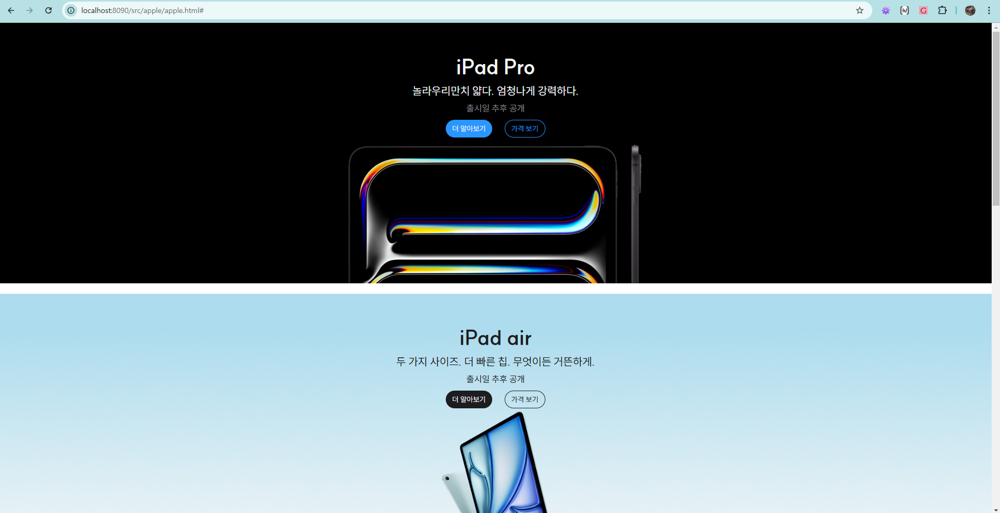
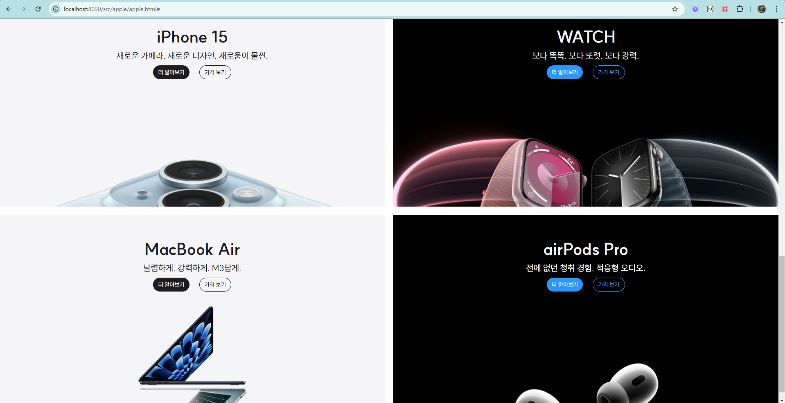
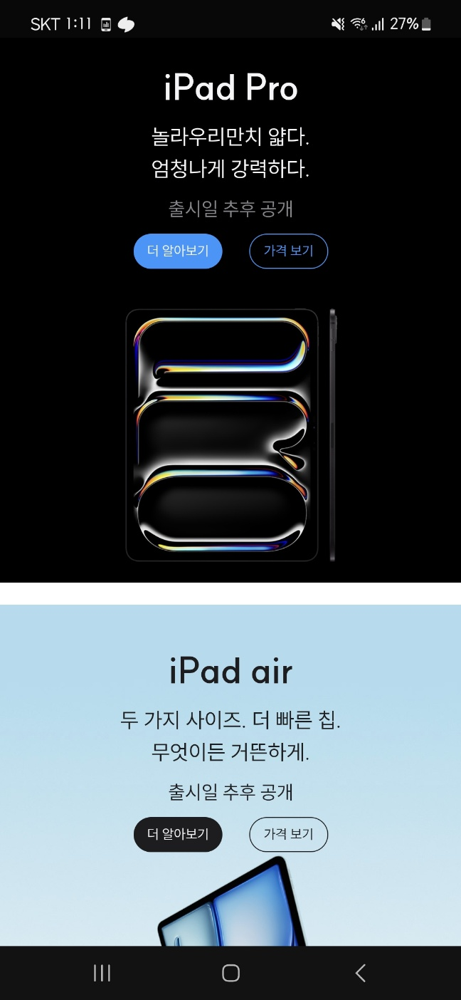
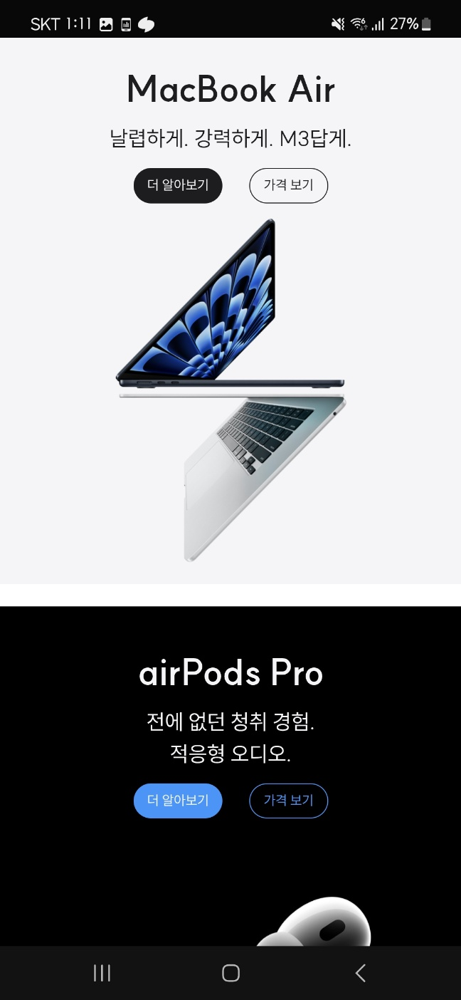
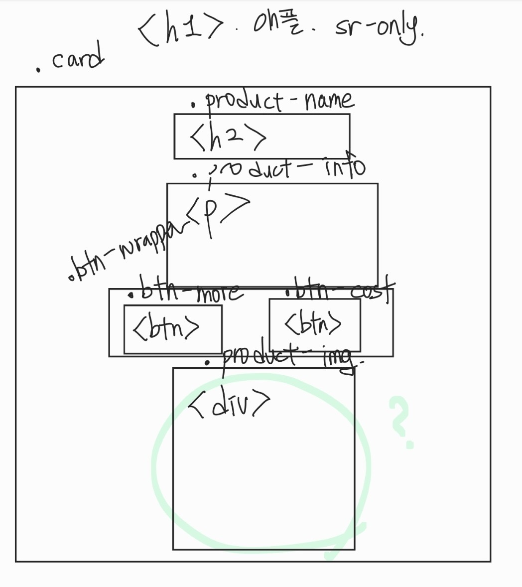
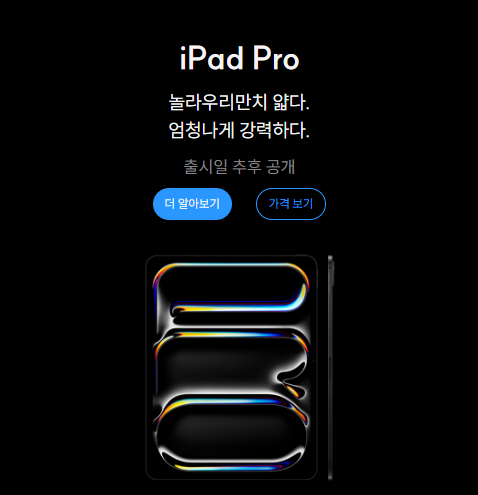

# 5주차 회고

## Apple 페이지 만들기

1. 완성한 Apple 페이지
<div style="display: flex; justify-content: space-between;">
  
  
</div>
<div style="display: flex; justify-content: space-between;">
  
  
</div>
<br/>
<br/>

- HTML과 CSS를 사용하여 페이지 크기에 따라 요소 크기를 유연하게 변화시킬 수 있도록 코드를 작성했다.

- 전체적인 레이아웃으로 Grid를 이용하였고, 특히 디바이스의 너비가 클 때의 하단에는 Grid로 배열을 다르게 하였다.

- 디바이스 종류에 따라 사용자 경험을 개선하기 위해 해상도에 따른 이미지를 설정했고, 레이아웃도 구성했다.

<br/>
<br/>

2. 기능 설명

i. 설계

<div style="display: flex; justify-content: space-between;">
  
  
</div>
<br/>
<br/>

- 페이지 내에서, 오른쪽의 그림을 하나의 컴포넌트로 설정하였고, 그 컴포넌트를 구성하는 요소들을 설계했다.

- 컴포넌트 `div`의 Class를 card로 설정하였고, 그 안에는 순서대로 `h2`, `p`, `button` 태그가 오는 것으로 설계하였다.

  - 다만, 처음 설계할때는 `button`에 `a` 태그를 사용할 생각을 못해서, 왼쪽의 설계도엔 나와있지 않다.

- 계층 구조를 맞추기 위해, `h1` 태그에는 이 페이지의 주제를 적었고, 그것을 `sr-only` 클래스로 화면에 보이지 않도록 하였다.

- 하단에는 `img` 태그를 넣으려 했으나, 요구사항에 따라 `div`에서 `background` 속성을 사용하는 것으로 방향을 맞추었다.

<br/>
<br/>

ii. `h2`, `p`, `button` 요소

- 요구사항에 맞는 폰트 크기, 위치 및 여백을 설정하였다.

- 조금 특별한 점은, 이 페이지에선 홀수번째의 `h2`, `p`, `button` 요소의 `color` 속성은 흰색을, 짝수번째의 `h2`, `p`, `button` 요소의 `color` 속성은 검은색을 갖고있다.

  - 따라서, 아래와 같은 코드로 구현하였다.

```css
&:nth-child(even) h2,
&:nth-child(even) p {
  color: var(--black);
}

&:nth-child(even) .btn-wrapper {
  .more {
    background-color: var(--black);
    color: var(--white);
  }

  .price {
    color: var(--black);
    border: 1px solid var(--black);
  }
}
```

<br/>
<br/>

iii. media query를 이용하여 `background` 처리

- 페이지를 크기에 따라 유연하게 만들기 위해, `1024px`을 기준으로 다른 이미지로 변경하도록 하였다.

- 또한, 해상도가 더 높은 디바이스를 위해 같은 이미지에 크기가 2배 큰 이미지로 변경하도록 하였다.

```css
&.iPad-Pro {
  background: url("../products/ipad_pro.jpeg") center top / cover no-repeat;

  @media (min-resolution: 192dpi) {
    background: url("../products/ipad_pro_2x.jpeg") center top / cover no-repeat;
  }

  @media (min-width: 64rem) {
    background: url("../products/ipad_pro_wide.jpeg") center top / cover
      no-repeat;

    @media (min-resolution: 192dpi) {
      background: url("../products/ipad_pro_wide_2x.jpeg") center top / cover
        no-repeat;
    }
    br {
      display: none;
    }
  }
}
```

<br/>
<br/>

iv. 레이아웃

- 컴포넌트를 설계할 때는, `flex`를 사용하였다.

  - `.card`에는 `flex-flow: column nowrap;`을 주었고, 두 개의 버튼을 감싸는 `div`인 `.btn-wrapper`에는 `flex-flow: row norwp;`을 주었다.
  - `.card`는 위아래 방향으로 배치될 수 있도록, `.btn-wrapper`는 양 옆 방향으로 배치될 수 있도록 구성하였다.

- 레이아웃을 배치할 때는, `grid`를 사용하였다.

  - 너비가 좁은 모바일 버전은 자동으로 1열 7행의 `grid`를 생성하기 때문에 코드를 생략하였다.
  - 데스크탑과 같이 너비가 넓은 디바이스를 위해 media query를 사용하였고, `grid-template-areas`를 이용하여 각 칸에 이름을 붙이고, 클래스에 할당했다.

```css
.card-container {
  display: grid;
  gap: 20px;

  @media (min-width: 64rem) {
    grid-template-columns: repeat(2, 1fr);
    grid-template-rows: repeat(5, 1fr);

    grid-template-areas:
      "item1 item1"
      "item2 item2"
      "item3 item3"
      "item4 item5"
      "item6 item7";

    .iPad-Pro {
      grid-area: item1;
    }

    .iPad-air {
      grid-area: item2;
    }

    .iPhone-15-Pro {
      grid-area: item3;
    }

    .iPhone-15 {
      grid-area: item4;
    }

    .WATCH {
      grid-area: item5;
    }

    .MacBook-Air {
      grid-area: item6;
    }

    .airPods-Pro {
      grid-area: item7;
    }
  }
```

<br/>
<br/>

v. 보완점

- 여러 소스를 사용해야하기 때문에 코드가 상당히 복잡해졌다.

  - 리팩토링을 통해 간단하게 고쳤으나, 더 수정이 필요해보인다.

- CSS 코딩을 하며, 아래 코드에 문제가 생겼었다.

  ```css
  .card {
    &.A {
      background: url("imageA.png");
    }
    &.B {
      background: url("imageB.png");
    }

    background-size: cover;
    background-position: center top;
  }
  ```

  - 원하는 방향은, `.A`와 `.B` 각각에게 배경 이미지를 주면서 `background-size: cover;`, `background-position: center top;`를 주는 것인데, `background-size`와 `background-position`은 계속 적용되지 않았다.

  - AI에게 도움을 청했지만, 엉뚱한 답변을 하여 다른 AI에게 다시 도움을 청했다.

  - 다른 AI 또한 틀린 답을 했지만, `우선순위`라는 키워드를 알려줬고, 그것을 계기로 mdn 문서를 더 찾아보게 되었다.

  - 덕분에 선택자 우선순위 개념을 다시 깨닫게 되었고, 해당 코드는 `.card`만 있는 `background-size`와 `background-position`보다 `.card.A`와 `.card.B`가 더 높은 우선순위를 갖게 되어 `background` 속성에 의해 해당 값들이 초기화 된다는 것을 깨닫게 되었다.

    <br/>
  <br/>

## HTML & CSS 강의

이번 과제에서는 상당히 얻어가는 것이 많았다. 처음 과제가 공개되었을 때는 '저런걸 어떻게 만들지...?'라고 생각을 했는데, 막상 만들다보니까 술술 만들어져서 작업 시간은 오래걸리지 않았다.<br/>다만... 복습을 자주 하지 않은 부분들에서 막히게 되었다. 가령, `Cascade` 규칙에서 우선순위를 기억하지 못해서 몇십분동안 애를 먹었었다. Chat GPT가 자꾸 엉뚱한 소리를해서 화가 났었었다... VSCode에 설치한 Copilot을 이용하니, 우선순위라는 말을 던져서 겨우 기억해냈고, MDN 문서와 강의자료(노션)을 다시 보게 되었다.<br/>아직 개발 경험이 적다보니, 내가 만든 코드가 효율적인지는 잘 모르겠다. 반복적으로 쓰인 부분을 제거하고 하나로 묶고, 필요 없는 코드를 제거하는 작업을 수행했지만 깔끔한 코드는 아닌 것 같아서 모르겠다... 깔끔한 코드가 뭔지도 아직은 잘 모르겠다.

이번주엔 전반적으로 `Grid`에 대해 배웠다. 초반에 강사님이 예전 개발자들은 `table`을 이용해서 `Grid`를 구현했다고 하시면서 로그인 컴포넌트 구성을 짜주셨는데, 내가 2년 전 웹 프로젝트를 할때 딱 그렇게 해서 조금 부끄러웠다... 덕분에 `Grid` 수업은 열심히 들을 수 있던거 같다. `Grid`를 한번 배우고 내가 이전에 만든 웹페이지를 보니까, 다시 `Grid`로 만들 수 있을 것 같다. 웹 페이지를 만들때 수직, 수평을 맞춰서 규칙적으로 나열하는 경우가 많아 유용하게 쓰일 기술이 될 것 같다.

이번주도 상당히 어려운 내용들이 가득한 한 주였다. 전공자니까 다 아는 것만 나올거라 생각했고, 프론트엔드는 쉬우니까 쉬운길로 가겠다고 친구들한테 말했었는데, 서서히 데이는 중이다... 아직도 친구들은 프론트엔드가 쉽다고 생각을 하는데 얘네도 내 마음대로 안움직이는 레이아웃의 맛좀 봤으면 좋겠다고 생각한다. ㅠㅠ <br/>하나하나 배우면서 내가 성장하는게 느껴지니 빨리 프로젝트를 하고싶다는 생각이 든다! 특히, Git을 사용해서 협업을 해보고 싶었는데, 곧 할수 있다는 생각이 드니 긴장이 되면서도 기대가 된다. 좋은 조원들을 만나서 재밌게 프로젝트를 했으면 좋겠다.
