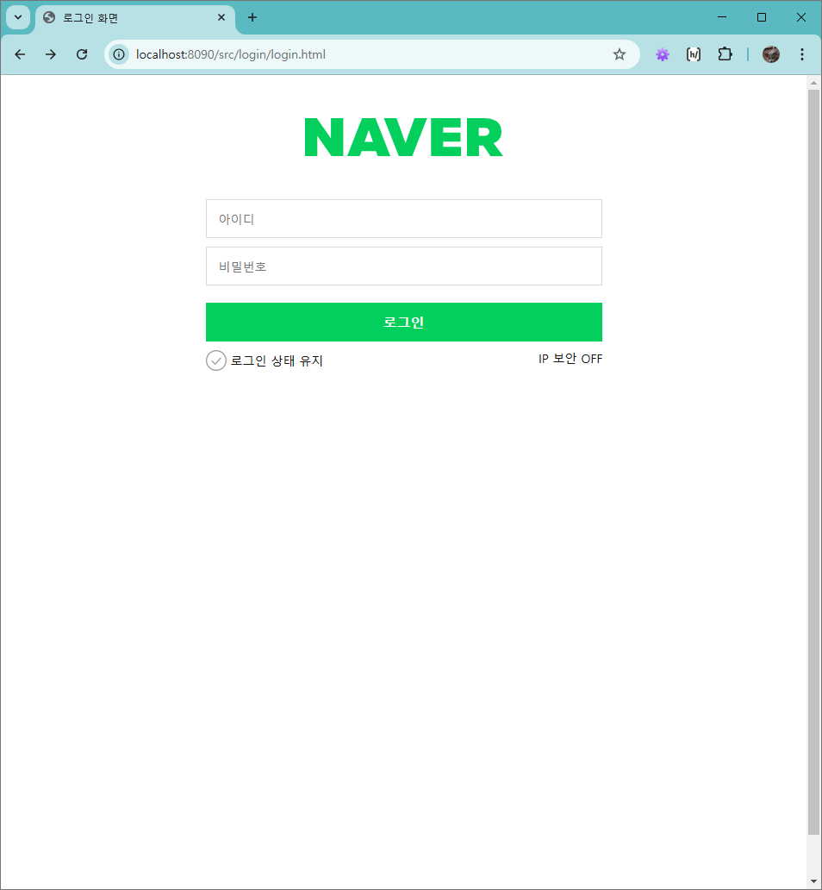
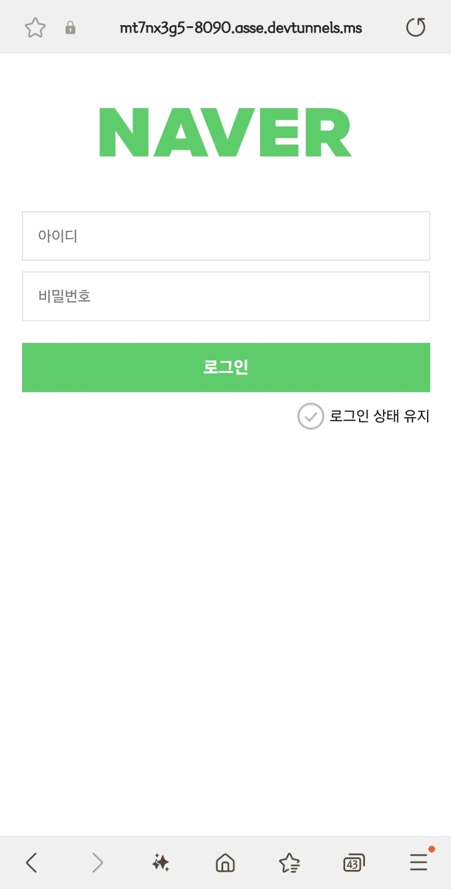
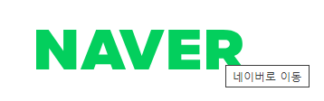
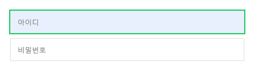
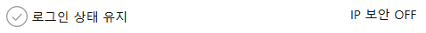
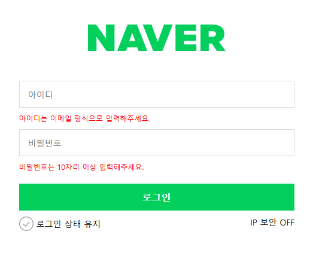

# 4주차 회고

## Login 페이지 만들기

> 네이버 로그인 페이지

### 1. 전체 화면


Desktop 기준 로그인 화면이다.<br/>


모바일 기준 로그인 화면이다.<br/>

### 2. 기능 설명

i. NAVER 로고



- `<svg>`로 만들어진 로고에 `display: block;`을 주었고, `margin-inline: auto;`를 이용하여 화면에서 중앙 정렬을 하였다.</li>
- `<a>` 태그를 이용하여 실제 네이버 주소와 연결시켰다.
  - 로그인 화면에서 홈으로의 전환을 해야하기 때문에 `target="_blank"`를 주지 않았다.
  - `title="네이버로 이동"`을 통해 마우스를 갖다 댔을때, 해당 요소의 역할을 사용자에게 알려주도록 하였다.

ii. 아이디와 비밀번호 (`<form>` 요소)



- Figma를 확인했을 때, 아이디 폼 부터 IP 보안 레이블까지 하나의 wrapper로 이루어졌기 때문에 그에 맞춰 `login-wrapper`를 만들었다.
- `login-wrapper`에 `display: flex;`, `flex-flow: column nowrap;`를 설정하여 열 방향으로 요소들이 정렬될 수 있게 하였다.
- `<input>` 요소는 요구사항에 맞게 구현했다.
- `focus`를 받았을 경우는 아래와 같이 구현하였다.

```css
.input {
  /* 앞의 코드 생략 */
  &:focus {
    outline: 2px solid #03cf5d;
    background-color: #e9f0fd;
  }
}
```

iii. 로그인 버튼 (`<button>` 요소)


- 아이디, 비밀번호와 마찬가지로 요구사항에 맞게 구현했다.

iv. 로그인 상태 유지 및 IP 보안 (`<input>` 요소)



- 레이아웃 배치를 위해 로그인 상태 유지와 IP 보안으로 `<div>`를 나누었고, 그 안에 ``, `<a>`와 `<input>`을 넣는 것으로 설계했다.
- 두 `<div>`를 배치하기 위해 `keep-ip-wrapper`를 만들었다.
- `keep-ip-wrapper`에 `display: flex;`, `flex-flow: row nowrap;`를 설정하여 행 방향으로 요소들이 정렬될 수 있게 하였다.
- 로그인 상태 유지는 `<input>`의 `checkbox` 속성을 이용하였고, 다음과 같이 구현했했다.
  - `appearance: none;`을 작성한 이유는, 브라우저에서 `checkbox`에 사용자 agent를 적용하지 않기 때문으로 알고있다.
  - `:checked` 가상 클래스를 이용하여 이미지를 변경하는 방식으로 하였다.

```css
input#state {
  appearance: none;
  inline-size: 1.5rem;
  aspect-ratio: 1/1;
  background-image: url("../img/unchecked.png");
  &:checked {
    background-image: url("../img/checked.png");
  }
}
```

- IP 보안은 로그인 상태 유지의 컴포넌트에서 체크되는 부분만 변형하였다.
  - `::after` 가상 요소를 이용하여 ON과 OFF를 구현했다.

```css
input#ip {
  appearance: none;
  inline-size: 1.5rem;
  aspect-ratio: 1/1;
  &::after {
    content: "OFF";
    color: #121212;
  }
  &:checked::after {
    content: "ON";
    color: #03cf5d;
    font-weight: bold;
  }
}
```

- 둘의 레이아웃은 모바일과 데스크탑에 따라 달라지도록 구현했다.

```css
.login-keep-state {
  justify-content: flex-end;
  @media (min-width: 768px) {
    justify-content: flex-start;
  }
}

.login-ip {
  display: none;
  @media (min-width: 768px) {
    display: block;
    justify-content: flex-end;
    text-align: right;
  }
}
```

- IP 보안을 클릭하면 관련 문서로 이동할 수 있도록 `<a>` 태그에서 마크업했다.

```html
<a href="./pages/ip_security.html" target="_blank">IP 보안</a>
```

### 3. 보완점

i. 에러 메시지 구현



```css
.error {
  display: none;
}
.input:invalid + .error {
  display: block;
  color: red;
  margin-bottom: 0.625rem;
  font-size: 0.75rem;
}
```

- 위와 같이 구현을 했지만, 저렇게 하면 로그인 버튼을 누르기도 전에 에러 메시지가 화면에 노출된다.
- 문제는, `input`에 content가 비어있는 것도 `invalid` 상태로 인식해서 에러 메시지가 노출된다는 점이라고 생각한다.
- javascript를 써서 동적으로 에러 메시지를 관리는 할 수 있겠지만, 아직 html과 css만으로 에러 메시지를 구현하기엔 부족한 것 같다.

## HTML & CSS 강의

마크다운을 복습하고 내가 설계한 내용을 정확하게 이해하기 위해 md 파일을 꾸며보았다. 강사님께서 피드백으로 마크다운 문서를 자주 만들어보길 권하셨기에, 앞으로 과제를 할 때마다 마크다운으로 구현한 내용들을 되짚어 볼 예정이다.

이번주는 내가 기존에 어려워했던 레이아웃 배치 부분을 배울 수 있었다. 여전히 배치는 어렵고, 과제로 했을때도 '왜 안되는거지?'하는 부분이 많았지만, 이전과 다른 점은 뭘 써야할지, 어떤 식으로 배치해야할지가 머리에 먼저 그려진다는 점이다.
<br/>
원래는 `flex`만 사용해서 레이아웃을 배치하고, 원하는 방향으로 배치가 안되는 부분이 나오면 그 부분은 삭제하거나 원하는 방향을 바꾸었었다...
<br/>
Chat GPT가 나오고, 프론트엔드 부분은 다 GPT에게 시켰던 것 같다. GPT도 못 만들면 그 부분은 포기했었다.
<br/>
이번 과제를 하면서도 막히는 부분들이 꽤 있었는데, 강사님께 배운 속성들을 하나하나 써보고 여러 조합으로 적용시켜보니 GPT 없이 페이지를 완성시킬 수 있었다.
<br/>
그래서 시간은 오래 걸렸지만... 이건 경험 부족이라 생각한다.
<br/>
앞으로 시간이 날 때면, 배운 기능들을 더 사용해서 내 것으로 만들고 싶다고 생각했다.
